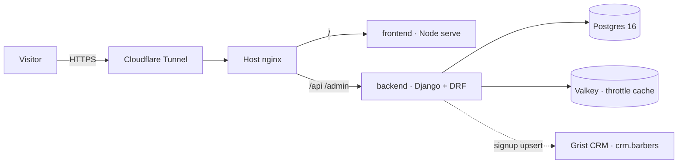

<p align="center"></p>

# The Craft — Vetted Community Platform for Beauty Professionals

**Live:** [barbers.navonsimon.com](https://barbers.navonsimon.com) · Hebrew RTL · Mobile-first

**Project story:** [How I built The Craft](https://simonhost.navonsimon.com/blog/building-the-craft-community) · **More work:** [16 production projects](https://simonhost.navonsimon.com/work)

An application-and-vetting funnel for a closed professional community of Israeli hair & beauty professionals. Candidates apply through a dark, iOS-glass landing page; each application is reviewed and approved by hand — including a **certification-mapping step** (certified academy track vs. independent track) that keeps the community credible.

## Highlights

- **Full-stack, fully containerized** — static frontend, Django + DRF API, Postgres 16, and Valkey, orchestrated with Docker Compose behind a host nginx + Cloudflare Tunnel edge.
- **Abuse-resistant public endpoint** — anonymous submissions are rate-limited with DRF throttling backed by a shared Valkey cache (`allkeys-lru`, memory-capped), so limits hold across gunicorn workers and deploys.
- **Hebrew-first admin** — Django admin localized to Hebrew serves as the vetting dashboard: sector filters, education search, one-click approval.
- **Lightweight by design** — dark oxblood/coral "ClickA." aesthetic is pure CSS (radial gradients, coral FAB accents) plus four real photographs (hero + 3 perk cards), all self-hosted WebP totaling ~74KB; no JS framework, no external image host.
- **Operational hygiene** — nightly `pg_dump` backups with rotation, healthchecked services, secrets in `.env` (never committed), TLS at the edge with `X-Forwarded-Proto` honored.

## Architecture



Signups (`POST /api/barbershops/`) are pushed asynchronously to the shop owner's
Grist CRM (`catalog/grist.py`, matched by `django_id`; the owner's status/notes
columns are never overwritten). Backfill/repair: `manage.py sync_grist`.

## Stack

| Layer | Tech |
|---|---|
| Frontend | Static HTML/CSS/JS, Frank Ruhl Libre + Heebo, RTL |
| API | Django 5 · Django REST Framework · gunicorn |
| Data | PostgreSQL 16 · Valkey 8 |
| Infra | Docker Compose · nginx · Cloudflare Tunnel |

## Run it

```bash
cp .env.example .env   # fill in secrets
docker compose up -d --build
# site → :8014 · API/admin → :8015
```

---

Built by **Simon Navon** — [consulting.navonsimon.com](https://consulting.navonsimon.com)
